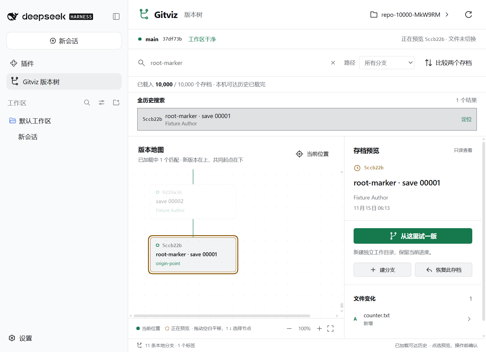
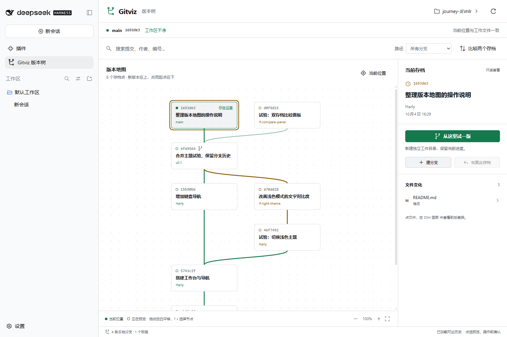
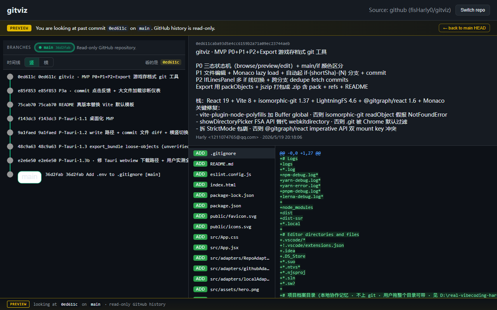

# gitviz

**游戏存档式 Git 仓库可视化与编辑工具。** 把 commit 当存档点、把改动当平行宇宙存档槽，用"读档 / 起新档"的直觉来浏览和实验性修改你的代码历史。

桌面应用基于 Tauri 2 + Rust，另有 VS Code 与 DSH 插件。启动后可拖入本地仓库；浏览器模式可只读浏览 GitHub 仓库。支持源码启动及本地构建的 Windows 免安装程序；NSIS 安装包已在本机和干净 CI 环境通过安装、同版本重装和卸载测试，尚未正式发行。

当前源码为 **0.3.0 开发版**。版本、打包校验和三系统 CI 见 [工程交付说明](docs/delivery.md)；历史 0.2.0 记录保留，旧包不会自动包含后续修复。参与开发见 [贡献指南](CONTRIBUTING.md)，安全问题见 [反馈方式](SECURITY.md)。

首次使用请看 [打开仓库、理解预览与排错](docs/first-use.md)。桌面可粘贴完整仓库路径后按 Enter；打开失败保留输入，方便修改重试。实际 HEAD 与预览位置分别显示，选节点不改文件。三端 Git 启动失败会提示 Git、目录、PATH 和宿主重启检查，VS Code 另提示 `git.path`。

| 入口 | 历史浏览 | 修改与试验 |
|---|---|---|
| Windows 桌面本地（开发版） | 完整本机可达历史、全局搜索、横竖地图 | 确认后建分支、切换、独立 worktree、备份后恢复；实验性编辑与导出 |
| VS Code 插件 | 完整本机可达历史、节点比较、原生 Diff | 确认后切换、独立 worktree、备份后恢复为新提交 |
| DSH Web 插件 | 完整本机可达历史、节点比较、面板内 Diff | 同上；地图仓库独立于 DSH 对话工作目录 |
| GitHub 在线浏览 | 有数量限制的远程历史 | 只读 |

## 大历史版本地图（0.2.0）

当前源码正在推进下一版公开产品交付，完整验收见 [交付清单](spec/modules/public-product.md)。开发版桌面已改用真实 Git 切换与提交，增加操作预览、一次性确认、仓库/HEAD 校验、编辑文件保护和正常窗口关闭保护。三端新增持久操作记录、失败提交继续入口、Git 命令超时处理和地图折叠/引用导航；本地保留的旧 0.2.0 安装包不会自动升级，也不包含这些更新。剩余跨宿主边界、首次使用和正式发布验收尚未完成。

桌面选择节点后，可在右侧“存档操作”建分支、创建独立试验工作区或恢复为新提交。建分支不切换当前文件；试验目录创建后，点击“在地图中打开试验工作区”才更换当前浏览仓库；恢复完成显示新提交与备份分支。所有本地分支均显示在分支栏。外部 Git 操作后点击“刷新历史”，实际位置与分支列表同步；正在编辑时仍保留原保存基准，拒绝把陈旧编辑写到新的 HEAD。

桌面本地、VS Code、DSH 都支持逐批加载完整的本机可达历史：默认首批 300 条，可继续加载或连续读到末尾，随时停止。全历史搜索覆盖提交标题、作者、OID 和引用名，点结果可加载并定位；地图只渲染视口附近的节点。

开发版地图默认折叠普通连续提交，保留 HEAD、分支/标签、分叉、合并和所选节点。点击虚线摘要可展开，方向键仍逐个选择真实提交。“分支与标签”可检索、加载并定位引用；“只看节点附近”按父/子关系展示前后 1–8 步，明确标出局部范围。搜索和比较目标自动显露，以上操作都只改变浏览。使用说明与验证边界见 [长历史探索](docs/map-exploration.md)。

点击节点只改变预览，不更换仓库目录，也不改变 HEAD 或工作文件。绿色 HEAD 表示实际位置，选中节点表示正在查看的存档。三端明确的“切换”或“恢复”操作才修改工作文件，执行前会显示确认；桌面编辑也需要确认创建并切换试验分支。

提交失败后，展开右侧“操作记录与恢复”可查看开始位置、备份、错误和执行结果。解决 Git 身份、签名或钩子问题后，点击“检查并继续提交”，确认后提交保留的暂存内容。HEAD、分支、暂存区或工作文件已变化，以及出现未跟踪文件时会拒绝继续，不会自动覆盖或暂存新改动。桌面需先结束文件编辑；崩溃留下的“进行中或已中断”记录只供检查。详见 [恢复说明](docs/operation-recovery.md)。

桌面关闭时，未保存的编辑内容和提交说明需确认放弃；取消会保留草稿。Git 操作、导出或确认尚未结束时暂不关闭，完成后需再次关闭。明确放弃不会删除已写入的文件、暂存内容、分支或恢复记录。此保护不涵盖强制终止、断电或崩溃，详见 [关闭行为与测试](docs/desktop-close.md)。

开发版 VS Code / DSH 已确认且交给独立进程的操作，会在关闭面板、退出 VS Code 或停用 DSH 插件后继续执行并保存记录。关闭旧面板或停用后，尚未开始的迟到确认不能写入。重新打开后检查实际状态与操作记录；强杀执行进程、整个进程树或断电仍可能留下未完成记录和锁。详见 [插件关闭行为](docs/plugin-lifecycle.md)。

Git 命令超时或输出超限会明确报错，尝试停止本次进程树，并保留已经产生的更改。若无法确认进程已停止，当前会话暂停写入，已取得的操作锁保留；需先检查进程和仓库状态，不能直接重试。Windows 的真实 hook、派生进程与恢复流程已验证；Linux/macOS 后端测试已在 CI 通过，原生界面仍待验收。详见 [超时与异常进程处理](docs/git-processes.md)。

开发版三端共有的本地操作均在执行前显示仓库、实际 HEAD/分支、目标提交与文件影响。VS Code 输入分支名后还需最终确认；两个插件显示文件总数及前 8 个文件，明确标出未展开数量。预览绑定历史版本：确认期间目标分支或其他引用被外部更新，会拒绝旧操作并要求重新预览；取消不创建操作记录。

写入前会检查稀疏检出、隐藏文件改动的 index 标记、子模块修改和进行中的 Git 操作，执行时再次核对。恢复的子模块限制、忽略文件冲突和身份问题会在预览阶段提示。不会自动清除标记或丢弃修改；详见 [写入前检查](docs/write-preflight.md)。

Git 命令结束后还会核对实际分支、提交父关系、内容、备份和工作区。hook 或外部工具改变结果时会记录异常并保留现场；“失败”不等于没有创建提交，需先检查实际状态再操作。恢复或编辑暂存期间混入其他内容，会在提交前停止。详见 [执行结果检查](docs/operation-outcomes.md)。

Windows 三端原生界面已验证：分支被其他 worktree 占用、确认后索引锁冲突、实际写入权限拒绝，以及 hook 失败后的取消与继续提交。失败现场、备份和提交结果均通过真实 Git 核对；DSH 另已验证插件管理页停用期间的恢复完成和重启用记录。脚本、环境要求与边界见 [原生失败流程测试](docs/native-failure-testing.md)。这不替代其他平台、正式安装和升级验收。

Windows 三端同时打开同一仓库的恢复流程也已验证：写入期间的竞争请求和完成后的过期确认均被拒绝，备份与提交结果正确。桌面“刷新历史”现在会同步重读操作记录；其他端完成或失败后，即使 HEAD 未变化，也能刷新到实际状态。已验证从桌面继续 DSH 留下的失败提交，见 [三端并发验证](docs/native-concurrency-testing.md)。该保护不能阻止外部 Git 工具自行写入。

已用含分叉/合并的 2000、5000、10000 条真实 Git 历史验证分页、搜索与父连接；没有总条数硬上限，更大规模尚未实测。范围包括本机 heads/remotes/tags 和 HEAD 可达提交，不自动 fetch；浅克隆会提示。GitHub 在线浏览仍使用原有只读图，未纳入本轮扩容。验证详情见 [大历史交接](memory/handoff-2026-10-04-large-history.md)。



三端实机检查均覆盖：加载下一批、连续加载与停止、搜索并定位最早提交、跨可见区域键盘选点，以及操作前后 HEAD 和工作文件保持不变。桌面还验证了横竖地图切换；原生文件选择框未自动化验证。

## VS Code 交互式版本树（0.2.0）

新增独立 VS Code 插件：真实分叉/合并地图、节点预览、双存档比较、原生 Diff、独立 worktree，以及保留历史的版本恢复。这个入口与下方旧 Tauri 应用并存，使用本地 Git 命令执行写入。

```powershell
npm run extension:package
# 在 VS Code 中执行“扩展: 从 VSIX 安装”，选择 artifacts/gitviz-0.3.0.vsix
# 打开本地仓库，执行“Gitviz: 打开交互式版本树”
```

“恢复此存档”先备份当前引用，再创建内容与目标版本一致的新提交；不会删除后续历史。工作区不干净时阻止恢复和切换。完整说明见 [插件使用说明](extensions/vscode/README.md)。

## DSH 交互式版本树（0.2.0）

已适配 DeepSeek Harness **0.2.0-rc.2 Web profile**：侧栏版本树、仓库选择、面板内逐行差异、双节点比较、分支切换、独立 worktree 和保留历史的恢复。与 VS Code 共享地图和 Git 后端。

```bash
npm run dsh:package
# DSH → 插件 → 添加插件，输入 artifacts/fisharly-gitviz-dsh-0.3.0.tgz 的绝对路径
# 安装完成后选择“立即启用”，打开侧栏“Gitviz 版本树”
```

仅支持本机回环地址的 DSH Web；没有接管 DSH 对话的工作目录。Windows 试验目录默认 `F:/Codex/worktrees`。使用说明见 [DSH 插件](extensions/dsh/README.md)，实现边界见 [适配契约](docs/dsh-adapter.md)。

**从旧版更新 DSH 插件后请重启 DSH**，让服务端加载新版 Git 后端。仅刷新页面不足以清除旧模块缓存。



| 你想做什么 | 启动命令 | 可用能力 |
|---|---|---|
| 打开本地 Git 仓库 | `npm run desktop:dev` | 本地历史、实验性编辑、if 分支导出，也可只读浏览 GitHub |
| 只看 GitHub 仓库 | `npm run dev` | 浏览器中查看历史与变更；不支持本地文件夹、编辑或导出 |
| 生成 Windows 可执行文件 | `npm run desktop:build` | 构建 `.exe`，跳过 MSI/NSIS 安装包工具链 |

构建前在仓库根目录执行 `npm ci`。VSIX 和 DSH tarball 输出到 `artifacts/`；Windows 程序输出到 `src-tauri/target/release/gitviz.exe`。这些生成文件不随源码提交，也尚未发布到扩展商店。运行桌面程序需要 WebView2 和 PATH 中的 Git；从源码构建还需要 Rust 与 Windows C++ 工具链。



截图来自本项目公开提交历史。浏览器匿名请求被限流时，可使用有读取权限的 token。

---

## 这是什么

gitviz 用"游戏存档"的方式理解 Git：

- **commit = 存档点** —— 点击任意旧 commit，进入 Preview 模式（就像读档回到过去）
- **改动 = 起平行宇宙** —— 在 Preview 状态下编辑文件，会创建一个 `if-<shortSha>-<N>` 分支。编辑会写入真实工作目录，并切换真实 HEAD；请先在专用测试克隆中试用。
- **Export = 导出存档** —— 把 if 分支导出为 `.zip`（含 git loose objects），可在任何真 Git 仓库中 `git fetch` 恢复，SHA-1 字节级一致

目标受众是作者自己，属个人 vibe-coding 工具。新的插件入口将真实 Git 分支树与游戏存档交互结合，帮助看清当前进度、历史版本和试验路线。

## 当前状态

| 项 | 状态 |
|---|---|
| 三端本地大历史地图（0.2.0） | 已完成，2000/5000/10000 条真实 Git 历史及三端 10000 条 UI 验证通过 |
| VS Code / DSH 插件 | VSIX / tarball 已构建并在隔离配置中安装验证 |
| 桌面化 MVP（read 路径 + 三态状态机 + 拖放） | 已完成，用户实测通过 |
| 桌面写入（开发版 prepare / execute） | 建分支、切换、worktree、恢复与受保护的编辑提交；10 组真实 Git 测试通过，含 Rust/Node 双向恢复及预览期间引用变化拒绝；完整产品验收进行中 |
| 操作记录与继续提交（开发版） | 三端共用记录格式；失败后核对检查点并确认继续，关联 worktree 记录独立 |
| Export 导出 if 分支为 zip（loose objects） | 已完成，git cat-file / fsck / fetch 字节级验证通过 |
| commit 详情 file diff（side-by-side / patch） | 已完成 |
| commit 图横 / 竖切换 | 已完成 |
| GitHub 远程仓库浏览（只读） | 已实现 |
| Windows 安装包 | NSIS 已通过本机及干净 CI 安装、重装、卸载；旧免安装版升级衔接也已验证，最终发行验收仍在进行。未提供 MSI |
| 持久化"记住上次打开的 repo" | 未做（路线图 P4） |

2026-10-04 已重新验证 Windows 桌面下的新增/修改/删除差异、编辑提交、真实 Rust 导出与保存、导入后的 SHA 一致性，以及提交后切换仓库。原生文件对话框未自动化验证；完整范围见 [本轮交接](memory/handoff-2026-10-04.md)。

开发版桌面动作与编辑流程的可复现脚本见 [桌面冒烟测试](docs/desktop-testing.md)，使用独立 WebView2 profile 和合成仓库。

## 功能特性

- **三态状态机**：Browse（浏览）→ Preview（预览旧存档）→ Edit（编辑起平行宇宙）
- **可视化 Commit 图**：本地使用共享 DAG 地图、完整合并边与视口渲染，支持横 / 竖切换；GitHub 在线模式保留 `@gitgraph/react`
- **内嵌代码编辑器**：Monaco Editor（VS Code 同引擎），动态加载，多语言语法高亮
- **分支管理**：顶部分支切换条，一键在主线和各 if 线之间跳转
- **文件 Diff 查看**：选中 commit 后查看改动文件列表 + side-by-side diff（`react-diff-viewer-continued`）或 patch 视图
- **导出 if 分支**：导出 `.zip`（含 git loose objects + refs + HEAD + 导入说明），可在任何仓库 `git fetch` 恢复
- **拖放打开**：直接把文件夹拖进窗口即可打开仓库
- **GitHub 仓库浏览**：通过 GitHub API 浏览远程仓库，只读（不支持编辑 / 导出）
- **桌面原生体验**：Tauri 2 + Rust（gix）直接读写磁盘，无浏览器存储限制

## 技术栈

| 层 | 技术 | 版本（当前 lock） |
|---|---|---|
| 桌面框架 | Tauri | 2.11.2 |
| 前端 UI | React | 19.2 |
| 构建工具 | Vite | 8.0 |
| 本地 Commit 图 | 共享 React DAG 地图、视口渲染 | 项目内实现 |
| GitHub Commit 图 | @gitgraph/react | 1.6 |
| 代码编辑器 | @monaco-editor/react（动态加载） | 4.7 |
| Diff 视图 | react-diff-viewer-continued + diff | 4.2 / 9.0 |
| 导出打包 | jszip | 3.10 |
| GitHub API | @octokit/rest | 22.0 |
| Git 引擎（后端） | gix（纯 Rust，tree-editor feature） | 0.73 |
| 后端语言 / 运行时 | Rust + tokio + flate2（zlib） | edition 2021 |

后端不再使用 isomorphic-git / lightning-fs / Buffer polyfill。桌面大历史读取和开发版写入通过 Git CLI，提交详情与导出使用 Rust gix；VS Code 和 DSH 的操作使用 Git CLI。浏览器保留 GitHub 只读入口。

## 快速开始

### 前置条件

| 依赖 | 说明 |
|---|---|
| Node.js 20.19+（20.x）或 22.12+ | 与当前 Vite 8 要求一致；建议使用满足要求的 LTS 版本 |
| Rust stable（rustup + cargo，Windows MSVC 工具链） | 桌面模式需要，首次编译会下载依赖 |
| Visual Studio C++ Build Tools + Windows SDK、WebView2 | Windows 桌面构建与运行需要，详见 [Tauri 前置条件](https://v2.tauri.app/start/prerequisites/#windows) |
| Git（在 PATH 中） | 三端本地版本地图运行需要；也用于克隆、测试和导入分支 |
| Windows 10/11 | 主要开发测试平台；macOS / Linux 理论支持但未充分验证 |

### 安装与运行

```powershell
# 1. 克隆仓库
git clone https://github.com/fisHarly0/gitviz.git
cd gitviz

# 2. 安装前端依赖
npm ci

# 3. 启动桌面开发模式（首次编译耗时取决于网络与机器）
npm run desktop:dev
```

首次启动会编译 Rust 后端，之后前端改动走 HMR。只需浏览 GitHub 时，运行 `npm run dev` 并打开终端显示的地址，无需 Rust。两种开发模式共用固定端口 5173，请勿同时启动。

### 快速体验

启动后桌面窗口自动打开。你可以：

1. 点 **Choose folder** 按钮，选择一个本地 Git 仓库（选包含 `.git` 的目录，不是 `.git` 本身）
2. 或直接把文件夹**拖进窗口**
3. 或切到 **GitHub** 标签页，输入 `owner/repo` 浏览远程仓库

想快速试一下，创建一个测试仓库：

```powershell
mkdir test-gitviz; cd test-gitviz
git init
echo "v1" > a.txt; git add .; git commit -m "v1"
echo "v2" > a.txt; git commit -am "v2"
echo "v3" > a.txt; git commit -am "v3"
# 然后在 gitviz 中选择 test-gitviz 目录
```

详细操作见 [入门教程](./TUTORIAL.md)。

## 命令参考

| 命令 | 作用 |
|---|---|
| `npm run desktop:dev` | 启动桌面窗口 + 前端开发服务器 |
| `npm run desktop:build` | 构建 release 可执行文件，默认位于 `src-tauri/target/release/gitviz.exe`，跳过安装包生成 |
| `npm run desktop:bundle` | 构建正式安装包；需要额外下载 WiX/NSIS 工具链，发布尚未验证 |
| `npm run dev` | 浏览器 GitHub 只读模式，`http://localhost:5173` |
| `npm run build` | 仅构建前端（输出到 `dist/`） |
| `npm run lint` | ESLint 检查 |
| `npm test` | GitHub 仓库地址与会话存储边界回归 |
| `npm run preview` | 预览前端构建产物 |
| `cargo check`（在 `src-tauri/` 下） | Rust 端类型检查 |

## 项目结构

| 路径 | 说明 |
|---|---|
| `src/main.jsx` | 前端入口（已拆 StrictMode，避免 @gitgraph 双 mount） |
| `src/App.jsx` | 顶层组件，集成 useSession + 拖放监听 |
| `src/App.css` | 全局样式（暗色主题） |
| `src/state/useSession.js` | 三态状态机（browse / preview / edit）+ actions |
| `src/adapters/RepoAdapter.js` | 适配器接口定义（JSDoc 类型） |
| `src/adapters/tauriAdapter.js` | Tauri 后端适配器（invoke 调 Rust，kind = local） |
| `src/adapters/githubAdapter.js` | GitHub API 适配器（Octokit，只读） |
| `src/components/RepoLoader.jsx` | 仓库加载器（本地文件夹 / GitHub URL） |
| `src/components/CommitGraph.jsx` | @gitgraph/react commit 图 + 横竖切换 toolbar |
| `src/components/CommitDetail.jsx` | 右侧详情面板 + Edit 入口 + diff 视图 |
| `src/components/EditorPanel.jsx` | Monaco 编辑器 wrapper |
| `src/components/IfLinesPanel.jsx` | 顶部分支切换条（主线 + if 线 chip） |
| `src/components/ExportButton.jsx` | 导出 if 分支为 `.zip`（dialog.save + Rust 落盘） |
| `src/components/PreviewBanner.jsx` | Preview 模式顶部黄色横幅 |
| `src/components/ModeStatusBar.jsx` | 底部状态栏（三态指示） |
| `src-tauri/src/lib.rs` | Tauri 入口 + 全局状态（Mutex 存 repo_path） |
| `src-tauri/src/commands/repo.rs` | 读命令（open / list_branches / list_commits / get_commit_detail / read_file_at） |
| `src-tauri/src/commands/branch.rs` | 当前分支与 HEAD 查询 |
| `src-tauri/src/commands/operations.rs` | 桌面操作预览、确认、状态校验、真实 Git 写入与回归测试 |
| `src-tauri/src/commands/export.rs` | 导出命令（export_bundle loose objects / save_export_zip） |
| `src-tauri/Cargo.toml` | Rust 依赖（gix / tokio / flate2 / dialog plugin / serde） |
| `src-tauri/tauri.conf.json` | Tauri 配置（identifier `cn.hlhaya.gitviz`，窗口 1280x800） |
| `src-tauri/capabilities/default.json` | Tauri 权限（仅 `core:default` + `dialog:allow-open` + `dialog:allow-save`，不开 `fs:*`） |
| `gitviz-档案/` | 项目开发档案（日志 / 调研 / 状态档案，已 gitignore，不在 git 中） |

## 使用说明

### 基本工作流

1. **打开仓库**：Choose folder / 拖放 / GitHub URL
2. **浏览历史**：左侧 commit 图，点击任意 commit 查看详情
3. **预览旧版本**：点击非 HEAD 的 commit，进入 Preview 模式（黄色横幅提示）
4. **编辑文件**：在 Preview 状态下点击文件旁的 Edit 按钮，自动创建 if 分支并打开编辑器
5. **保存改动**：编辑完成后点 Save & Commit，改动落到 if 分支
6. **切换分支**：顶部 IfLinesPanel 在主线和各 if 线之间切换
7. **导出**：切到某个 if 分支后点 Export 导出 `.zip`

### 状态机说明

```
BROWSE  -- 点旧 commit -->  PREVIEW  -- 点 Edit -->  EDIT
  ^                            |                       |
  |        回到 HEAD           |     onCommitInIf      |
  +----------------------------+-----------------------+
```

- **BROWSE**：默认状态，浏览当前分支最新代码
- **PREVIEW**：查看旧 commit 的文件内容（只读），黄色横幅提示
- **EDIT**：在 if 分支上编辑文件，编辑器打开

> **桌面写入仍在公开产品验收阶段。** 当前开发版先预览并确认影响，再通过 Git 同步 HEAD、暂存区和工作文件；保存使用用户配置的身份、钩子与签名。编辑文件采用临时文件替换，拒绝越界、Git 元数据与符号链接路径。提交失败时保留编辑内容和暂存更改，可通过“操作记录与恢复”检查并继续提交。桌面内嵌编辑使用当前工作目录；插件的独立试验使用 worktree。旧 0.2.0 桌面包仍是仅更新 HEAD 的实验性实现，请勿混淆版本。GitHub 模式保持只读。

### GitHub 模式

切到 GitHub 标签页，输入 `owner/repo`（如 `fisHarly0/gitviz`）或完整 GitHub 仓库 URL，也支持以 `.git` 结尾的克隆地址。公开仓库可不填 token；私有仓库需要有读取权限的 PAT。加载时禁用重复提交，空仓库和权限失败会显示可恢复提示。PAT 仅在可用的 sessionStorage 中保留；存储被禁用时仍可在当前连接使用，不写入磁盘或 localStorage。**GitHub 模式为只读，不支持编辑和导出。**

当前 GitHub adapter 最多读取前 100 个分支、100 个标签，每个分支最近 100 条提交；图谱不是完整历史，也不支持 GitHub Enterprise 地址。

### 导出与导入

导出的 `.zip` 包含：

| 内容 | 说明 |
|---|---|
| `objects/` | git loose objects（zlib 压缩，标准 `{ab}/{cdef...}` 布局） |
| `refs/heads/<branch>` | 分支引用 |
| `HEAD` | HEAD 指针 |
| `README.txt` | 导入命令说明 |

导入方法：

```bash
unzip if-xxx.zip -d /tmp/gitviz-import
cd /path/to/your/repo
git fetch /tmp/gitviz-import if-xxx:if-xxx-imported
git checkout if-xxx-imported
```

## 配置选项

### Commit 图方向

桌面地图工具栏有“竖向 / 横向”切换，默认竖向，本地地图方向在当前会话中生效。GitHub 旧图保留 localStorage 方向设置；VS Code 与 DSH 插件使用竖向地图。

### 历史数量

默认先读取 300 条，可用“加载更早历史”逐批读取，或用“连续加载全部”读到末尾；“停止加载”保留已加载的部分。VS Code 的 `gitviz.historyLimit` 设置每批数量（20–2000），不会限制历史总数。搜索覆盖尚未加载的本机可达提交，点击结果会自动加载到目标。

## 开发验证

```bash
npm run lint
npm test
npm run extension:test
npm run dsh:test
npm run history:test
npm run build
```

`history:test` 创建含分叉、合并的真实 Git 测试仓库，校验完整分页、父连接、搜索、旧 HEAD 边界和浅克隆。Windows 测试文件默认放在 F 盘，可通过 `GITVIZ_LARGE_TEST_ROOT` 指定其他测试目录。Rust 真实大历史测试需将 `GITVIZ_HISTORY_FIXTURES` 指向生成的 `report.json`，再运行 `cargo test --manifest-path src-tauri/Cargo.toml commands::history::tests`。

### Rust 工具链镜像（国内网络）

```powershell
# rustup 镜像
$env:RUSTUP_DIST_SERVER = "https://rsproxy.cn"
$env:RUSTUP_UPDATE_ROOT = "https://rsproxy.cn/rustup"
```

`~/.cargo/config.toml` 配置 crates.io 镜像：

```toml
[source.crates-io]
replace-with = "rsproxy-sparse"

[source.rsproxy-sparse]
registry = "sparse+https://rsproxy.cn/index/"
```

## 已知限制

| 限制 | 说明 |
|---|---|
| 无正式安装包 | MSI 打包（P-Tauri-1.4）未完成，wix314 工具链国内直下 hang，需换 ghproxy 镜像或改用 NSIS；目前靠 `tauri dev` 或手动取 `.exe` |
| Tauri 编译资源 | 首次构建时间随机器和网络而变，Rust 构建缓存可能占数 GB |
| Monaco 首次加载 | 约 2-3 秒冷启动（动态加载约 2MB） |
| GitHub 模式只读 | 不支持编辑和导出 |
| 不记住上次仓库 | 每次启动需重新选择仓库（路线图 P4 待做） |
| 超过 10000 条未实测 | 本地地图没有总条数硬上限，但已加载元数据仍驻留内存；更大规模的性能与大体积导出尚未压测 |
| 跨平台 | 主要在 Windows 开发测试，macOS / Linux 未充分验证 |

## 常见问题

**Q: 点 Choose folder 后报 "No git refs found"**

A: 确保选的是包含 `.git` 目录的仓库根目录，不是 `.git` 目录本身，也不是子目录。

**Q: `npx tauri dev` 卡在编译不动**

A: 首次构建会下载并编译依赖。先检查 `rustc --version` 和构建日志，区分下载失败、编译过程与缺少 C++ 工具链。

**Q: 端口 5173 被占用**

A: `vite.config.js` 配了 `strictPort: true`。先确认是否已运行浏览器或桌面开发模式；在自己启动它的终端按 Ctrl+C 退出后再重试。可用以下命令查询占用者：

```powershell
netstat -ano | findstr :5173
```

**Q: 编辑后 Save & Commit 没反应**

A: 确认处于 Preview 或 Edit 模式（底部状态栏显示 PREVIEW / EDIT）。Browse 模式下不出现 Edit 按钮。也确认打开的是本地仓库而非 GitHub（GitHub 模式只读）。

**Q: 导出的 .zip 怎么用？**

A: 解压后在你的真 Git 仓库执行 `git fetch <解压目录> <分支名>:<本地分支名>`，详见导出的 README.txt。

## 路线图（未做 / 候选）

| 优先级 | 项 |
|---|---|
| 高 | P-Tauri-1.4：MSI / NSIS 安装包打包，解决 wix 下载 hang |
| 中 | P4：跨 session 持久化，自动加载上次打开的 repo |
| 中 | rust-version 升级（1.77.2 → 解锁 gix 新版 API） |
| 低 | P3：黑魂 / Elden Ring 风存档槽位卡片视图（纯 UI） |
| 低 | P5：merge / rebase / cherry-pick 游戏化 UI |
| 低 | P6：GitHub adapter 写入（PAT push 到远程） |

## 许可证

代码中 `src-tauri/Cargo.toml` 声明 MIT，但仓库尚未附带独立 LICENSE 文件。当前定位是个人 vibe-coding 项目，欢迎 fork 自行使用。

---

源码：https://github.com/fisHarly0/gitviz | 作者：[fisHarly0](https://github.com/fisHarly0)
